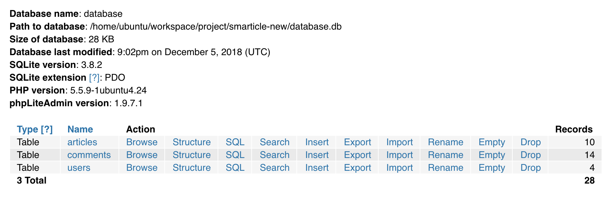

# Design

## Implementing Smarticle as a website

We chose to implement Smarticle as a website (instead of an iOS app as initially planned) for several reasons. First, it was easier
to work together on a website since one of us used iOS while the other used Windows. Second, this allowed us to scrape many useful
features from the finance pset, such as register and login. Using finance as a starting block also allowed us to do some good
experimentation with CSS to find an icon, logo, and theme for Smarticle.

> Logo

Third, many people today prefer to engage with articles on a bigger screen, so we thought having it as a website to begin with would
make more sense.

## Using separate SQL tables to store users, articles, and comments

We are using 3 separate SQL tables to store users, articles, and comments respectively. As discussed in lecture, this is more
efficient than storing them all in one, because we can use id tags to link comments to an article, and articles to a user. The
comments table contains the url of the article which the comment was in response to, while the articles table contains the user id
of the user who saved it. Some of the functions therefore need to select items to store 3 tables.

> Database

## How nested jinja for and if loops work to link the comments to the appropriate articles

The three tables come together through for and if loops in jinja. Starting with the for loops we used in lecture, we populate a
user’s profile with the saved articles. For each article, we select the appropriate comments by checking the article url, which is
saved in both the ‘comments’ and the ‘articles’ database, with an if loop. Then we loop through the ‘users’ table to link the
correct username to each comment.

> Jinja

## How we got articles to save using hidden input

To get the ‘save’ buttons to save an article to a profile, we had to convert the table with all the articles to a form with inputs.
We began with a typical bootstrap table, along the lines of the ones we made in finance and html, but then we also added hidden
inputs with the article title, url, and source, so that when the ‘save’ button is clicked, those hidden inputs would be inserted
into the database.

> Hidden input

## ‘Are you sure’ function

We wanted to double-check that a user definitely wants to delete an article if the ‘delete article’ button is clicked. We used
jQuery to get a pop-up window to confirm the deletion.

> Javascript

## Search function

To search using our API, we have to access urls that hold the information. Initially, this meant we could only search by country
using alpha 2 country codes. However, in order to make our website more user friendly, we used pycountry to convert country names
into country codes. We used capitalize to enable it to work for both lowercase and uppercase country names. However, due to the full
names of some countries used by pycountry, for example Russian Federation for Russia, we had to manually code some exceptions into
the python function. However, we decided that ultimately the improved user experience was worth the extra time and memory that the
program would use.

> Search by country

We initially had the option to search by source, however we had a similar problem; the url would only accept one specific format of
the source title, for example ‘abc-news’ is the only format that would be registered, not ‘abc’ or ‘abc news’. To avoid slowing down
the program too much by manually coding all the special cases, we decided not to allow people to search by source. This information
is already helpfully curated on the individual news websites.

## Duplicates
We decided that we wanted to prevent users from saving an article twice to their own profile. However, we do have the option to post
identical comments, and if one of those comments is deleted, the other one is not necessarily removed.
