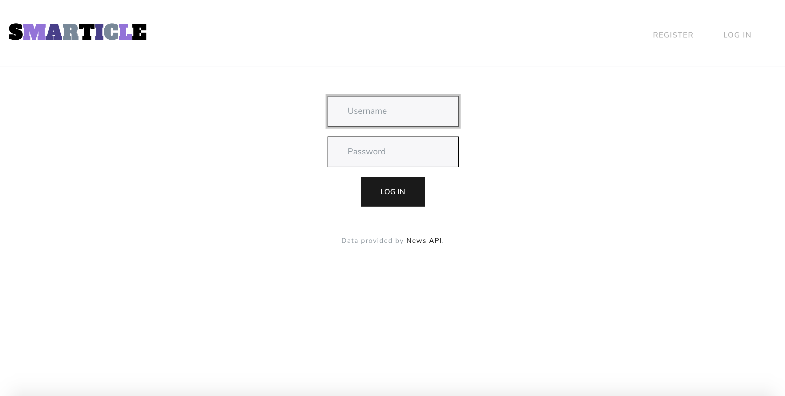
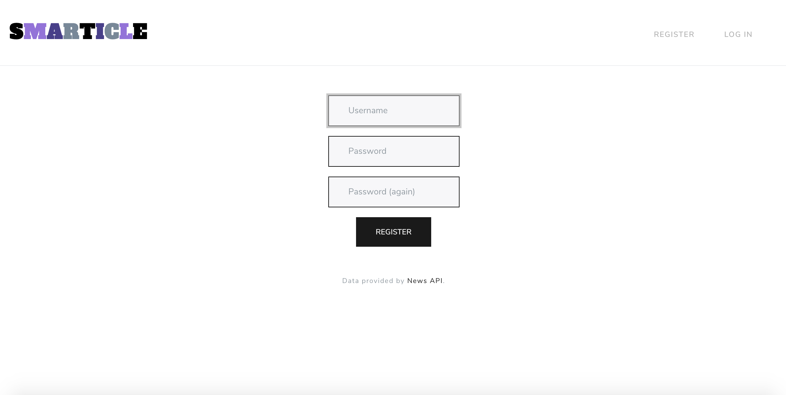
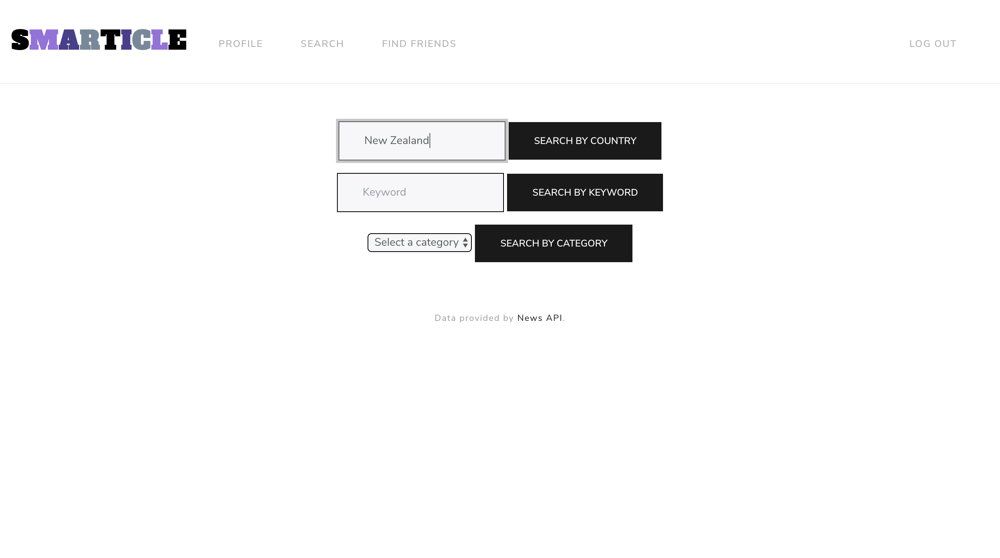
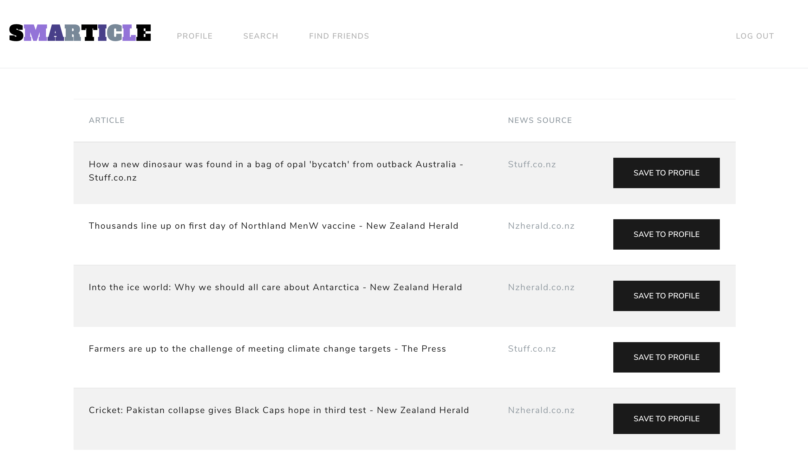
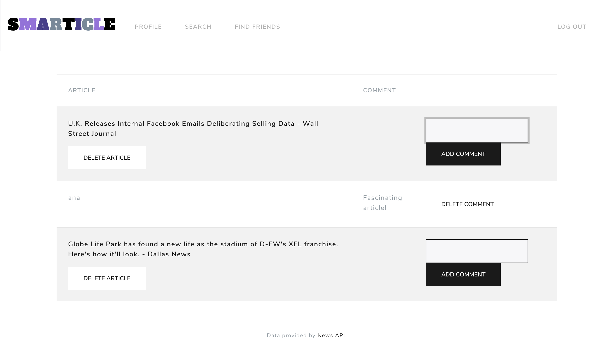
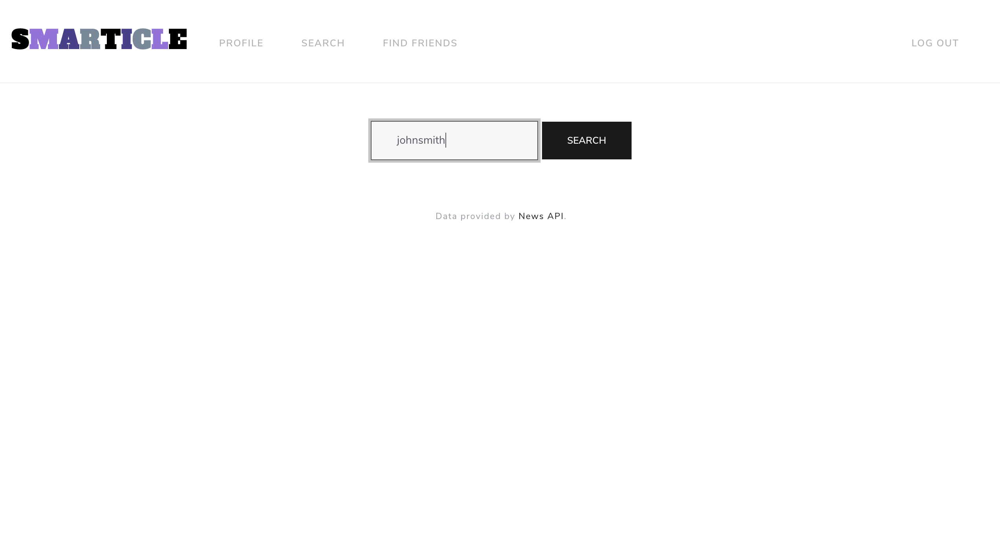
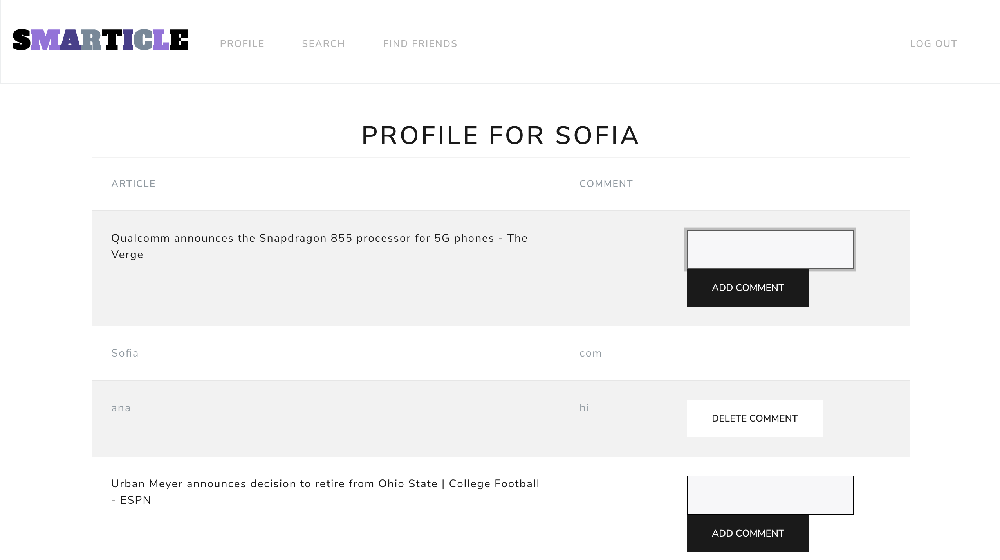

# Smarticle

## Implementation

Smarticle is a social media app for saving articles to your profile and sharing them with your friends. Smarticle came about with
several goals in mind:
* To allow you to save articles from different sources to a single profile
* To encourage discussion and combat the rise fake news epidemic through an accessible comment platform
* To access more information by visiting your friends’ profiles and seeing what articles they have saved.

How to install
Before running, install the following two packages:

```
Pip install newsapi-python
```

```
Pip install pycountry
```

Download the zip file containing the folder “Smarticle”. Unzip and open the folder in an IDE. From inside the file directory,
execute the following command:

```
flask run
```

If running the cs50 IDE, follow the link generated

```
https://ide50-USERNAME.cs50.io:8080/
```

Where USERNAME is replaced with your own username. This should launch the application, and the user can explore Smarticle.


## Logging in

The first page that you see will be the login page.



> The login page

Here, users can log in with their username and password, in order to be redirected to the homepage. If a user does not yet have an
account, they can register for one by selecting the ‘register’ tab in the top right hand corner of the page.

## Register

If a username is not taken, it is possible to register a username and an associated password. Once registered, you are immediately
logged in and sent to the homepage.



> The register page

## Homepage

Once a profile has been created (or logged into), the user is redirected to the homepage, which shows the top headlines in the US
today. The article titles contain hyperlinks to the articles themselves. The data on articles on this and other Smarticle pages is
provided by News API (https://newsapi.org/). The user can choose to save articles to their profile from here through the ‘save to
profile’ button.


> The homepage

If on another page, licking on the Smarticle logo will result in being redirected to the top headlines.

## Search

If the user would like to search for something more specific, they can click the ‘search’ tab in the navigation bar. Smarticle
allows the user to search by country, keyword, or category. The categories are ones already used by News API to categorize articles.
Searching by country allows the user to search for articles from that specific country. The country can be written with uppercase or
lowercase characters. A keyword can be any word/phrase the user would like to search for.



> Search for articles

Once the user has searched for something, they can see article titles relating to their search. They can check out the articles by
clicking on the titles, or save them to their profile.



> Search results

## Profile

The user profile contains all the saved articles of the user, with the newest first. The user can add a comment (e.g. ‘read later’
or ‘interesting take’). They can also delete their own comment, a friend’s comment, or an article that they have saved.



> Profile

## Find friends

The ‘find friends’ tab allows the user to search for their friend by their username.



> Search for friends

They will then be directed to their friend’s profile, where they can see articles shared by their friends, and add (and delete)
their own comments. Currently, the only privacy feature offered is that you must know your friend’s username to visit their profile;
this should be kept in mind when posting articles and comments on your own profile.



> Friend's profile
